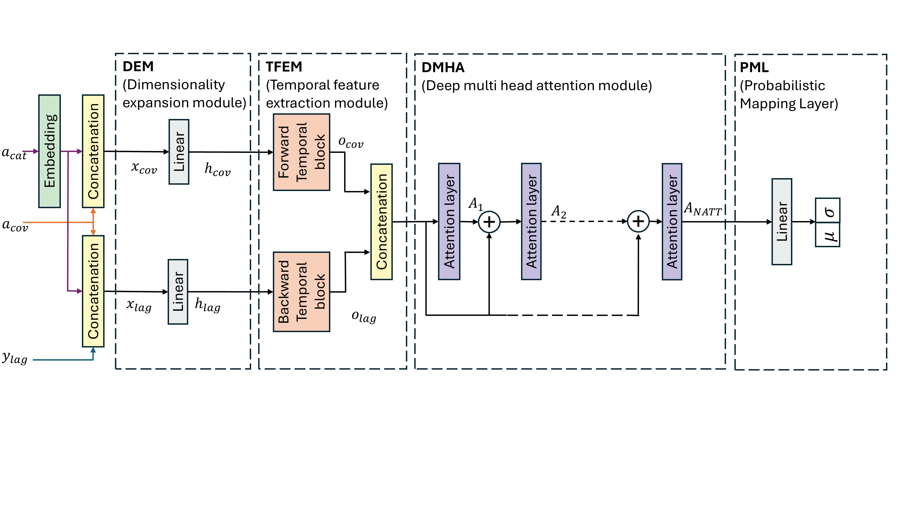

# An Ensemble Framework for Probabilistic Short-Term Load Forecasting Based on BiTCN and Deep Attention Networks #

_An Ensemble Framework for Probabilistic Short-Term Load Forecasting Based on BiTCN and Deep Attention Networks_ is a repository containing code for a new forecasting method for power load forecasting.  This architecture is trained and tested against state of the art methods using the code provided by the paper of to [Parameter Efficient Deep Probabilistic Forecasting (PEDPF)](https://www.sciencedirect.com/science/article/pii/S0169207021001850). For more details, see [our paper](https://www.techrxiv.org/doi/full/10.36227/techrxiv.174235483.35557269).

### Added files ###
├── algorithms/
│   ├── bitcn_att_skip.py       # BiTCN with skip connections and deep attention
│   └── bitcn_att_no_skip.py    # BiTCN with deep attention but no skip connections
│
├── train_test_electricity.py   # Main training and evaluation script for electricity dataset
├── paper figure generator.ipynb # Notebook to generate figures from paper results

### Reproduce paper's experiments ###
First, you need to download the necessary data file.
* [UCI Electricity](https://archive.ics.uci.edu/ml/machine-learning-databases/00321/) Download and extract `LD2011_2014.txt` to the folder `data\uci_electricity\` (create if necessary).

Then, run `train_test_electricity.py` for the paper's main results. This will sequentially run all variants of the suggested model (different hidden unit sizes : 10,15,20,25,30). 

Then you can refer to `paper figure generator.ipynb` to generate the figures of the paper.

### Reference ###
[Bilel Benziane](mailto:bilel.benziane@isen-ouest.yncrea.fr), Benoit Lardeux, Maher Jridi, Ayoub Mcharek. [An Ensemble Framework for Probabilistic Short-Term Load Forecasting Based on BiTCN and Deep Attention Networks](https://www.techrxiv.org/doi/full/10.36227/techrxiv.174235483.35557269). Submitted as a journal paper to [InternaIEEE Transactions on Power Systems](https://ieeexplore.ieee.org/xpl/RecentIssue.jsp?punumber=59).

### License ###
This project is licensed under the terms of the [Apache 2.0 license](https://github.com/elephaint/pedpf/blob/master/LICENSE).

### Acknowledgements ###
This project was a contribution of a new forecast architecture tested on the experimental protocol developed by [Airlab Amsterdam](https://icai.ai/airlab/).
